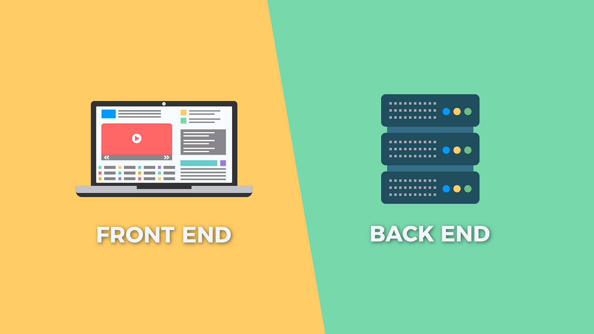

<h1 align="center">Hola 👋  soy Ronaldo / RonaldoLobatoCode ✨ </h1> 

    

  

 
<h2>Sobre mi 😃</h2>
<!--Intro start-->

:heart: Desarrollador Full Stack
  
🚀 Apasionado por la programación y la resolución de problemas.

🌐 Disfruto explorando nuevas tecnologías y tendencias en el mundo del desarrollo.

👥 Adoro el trabajo en equipo es clave para alcanzar el éxito en cualquier proyecto.

📫 Contacto: **contactoronaldolobato@gmail.com**
<!--Intro end-->
  

 

<h2 >Tecnologías conocidas👨🏻‍💻</h2>
<!--tech stack icons-->

  

 
<!-------------------------->

# 📊 GitHub Stats:

 

<!-- Proudly created with GPRM ( https://gprm.itsvg.in ) -->
